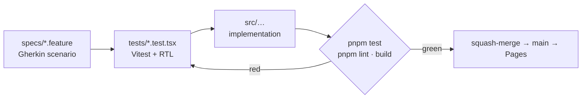
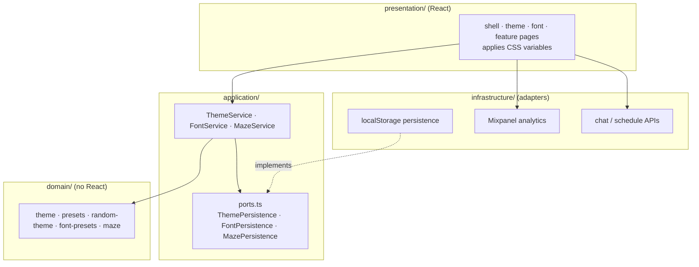

# Tomi Playground

[](https://github.com/babjatom/babjatom/actions/workflows/ci.yml)
[](https://github.com/babjatom/babjatom/actions/workflows/deploy.yml)
[](../LICENSE)

A Vite + React SPA for babjatom: CSS-variable themes, analytics charts, and Ask Tomi.

The app in this folder is served from GitHub Pages with routes:

- `/` — Ask Tomi chat (site home)
- `/adsb-radar` — live ADS-B radar with a fullscreen link to adsb.tomibabjak.dev
- `/theme-playground` — component showcase and visits table
- `/analytics` — visits table plus area, bar, line, pie, radar, radial, and tooltip charts
- `/dos-games` — curated shareware/freeware DOS games in-browser
- `/ask-tomi` and `/tomi-ai` — redirect to `/`
- `/privacy` — short privacy note (hosting, Ask Tomi, profile pixel)

The sidebar **Pages** menu lists Ask Tomi, ADS-B radar, Theme Playground, Analytics, and Dos games. Theme and font controls (including random theme) live on Theme Playground. A **Privacy** link sits under the sidebar footer.

## Features

- shadcn/ui components
- Tailwind CSS
- CSS-variable based themes
- theme switching
- random theme generation
- collapsible sidebar
- responsive mobile layout
- CSS-based visual effects
- localStorage theme persistence
- Mixpanel product analytics (Pages deploy + optional local `.env`)
- Self-hosted Outfit / Fraunces (Classic) plus techno typeface presets (no Google Fonts CDN)
- Vitest + React Testing Library
- Gherkin acceptance specs in `specs/`
- GitHub Pages deployment

## Tech Stack

- Vite
- React
- TypeScript
- Tailwind CSS
- shadcn/ui
- Vitest
- React Testing Library
- GitHub Actions
- GitHub Pages

## Development

From the `tomi-playground/` directory:

```bash
pnpm install
pnpm dev
pnpm test
pnpm build
```

Run tests in watch mode:

```bash
pnpm test:watch
```

Preview the production build locally:

```bash
pnpm preview
```

Vite is configured with `base: '/'` for the custom domain (`tomibabjak.dev`).

## Specs

User-facing behavior is specified as Gherkin in [`specs/`](specs/). Write or update those scenarios before implementing a feature. Vitest tests under `tests/` make the scenarios executable; there is no Cucumber runner.



The spec comes first and stays the contract: tests encode the scenarios, the
implementation makes them pass, and CI (`pnpm lint`/`test`/`build`) gates the
merge. See [`specs/README.md`](specs/README.md) for the workflow and the
spec→test file mapping.

## Adding a Theme

Themes are maps of **semantic CSS variables**. Components read those tokens; they are not restyled per theme.

Typical tokens:

```text
background
foreground
primary
primary-foreground
secondary
muted
accent
border
ring
radius
```

To add a preset theme:

1. Open `src/domain/presets.ts`
2. Call `createTheme(id, name, tokens)` with HSL channel values (for example `"199 89% 38%"`)
3. Theme Playground lists presets automatically — **do not duplicate components** for the new look

Random themes are produced in `src/domain/random-theme.ts` using the same token shape.

## Adding Components

1. Add a shadcn-style primitive under `src/components/ui/` (or generate with the shadcn CLI using `components.json`)
2. Import it in `src/presentation/theme-playground/component-showcase.tsx`
3. Prefer semantic utility classes (`bg-primary`, `text-muted-foreground`, `border-border`) so the control follows every theme

## Architecture

Lightweight hexagonal (ports & adapters) layering keeps domain logic
independent of React. Dependencies point **inward**: `presentation` and
`infrastructure` depend on `application`, which depends on `domain`. The
`domain` depends on nothing.



| Layer | Responsibility | Depends on |
| --- | --- | --- |
| `domain` | Theme/font/maze entities, presets, random generation (no React) | — |
| `application` | Use-case services + persistence **ports** (interfaces) | `domain` |
| `infrastructure` | Adapters: localStorage, Mixpanel, chat/schedule APIs | ports in `application` |
| `presentation` | React shell, sidebar, showcase, CSS variable application | `application` |

The domain and application layers can be unit-tested and reused without
mounting the UI.

## Analytics

Mixpanel tracks anonymous product interactions (page views, navigation, theme
and font choices, Ask Tomi send/result events) when `VITE_MIXPANEL_TOKEN` is
set. Copy `.env.example` to `.env` for local development. Without a token,
analytics no-ops.

The GitHub Pages deploy workflow injects `secrets.VITE_MIXPANEL_TOKEN` into the
production build so the public site sends events to Mixpanel’s EU API host.

## Deployment

Pushes to the `main` branch run `.github/workflows/deploy.yml`, which installs dependencies, runs the test suite, builds the Vite app, and deploys `tomi-playground/dist/` to GitHub Pages.

The workflow fails if tests or the production build fail.

Production URL:

```text
https://tomibabjak.dev/
```

(Legacy project URL: `https://babjatom.github.io/babjatom/` — may break after `base: '/'`.)

In repository Settings → Pages, set the source to **GitHub Actions** after merging.
