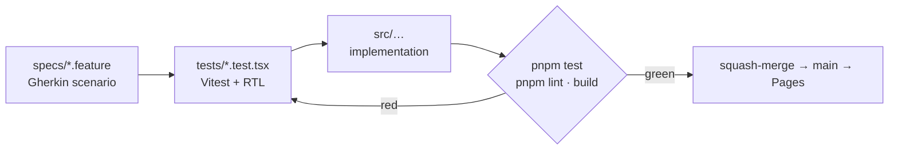
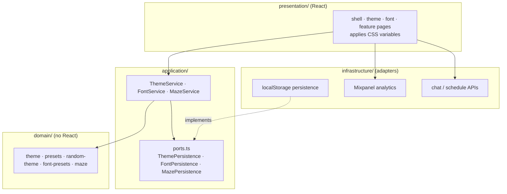

# Tomi Playground

[](https://github.com/babjatom/babjatom/actions/workflows/ci.yml)
[](https://github.com/babjatom/babjatom/actions/workflows/deploy.yml)
[](../LICENSE)

An SPA is a single-page app.
This folder is a Vite and React SPA for babjatom.
The app has CSS-variable themes, analytics charts, and Ask Tomi.

GitHub Pages serves the app in this folder.
The routes are:

- `/`: Ask Tomi chat (site home)
- `/adsb-radar`: live ADS-B radar with a fullscreen link to adsb.tomibabjak.dev
- `/theme-playground`: component showcase and visits table
- `/analytics`: visits table plus area, bar, line, pie, radar, radial, and tooltip charts
- `/dos-games`: curated shareware/freeware DOS games in-browser
- `/ask-tomi` and `/tomi-ai`: redirect to `/`
- `/privacy`: short privacy note (hosting, Ask Tomi, profile pixel)

The sidebar Pages menu lists Ask Tomi, ADS-B radar, Theme Playground, Analytics, Dos games, and Flood monitor.
Flood monitor opens https://flood.tomibabjak.dev/ in a new tab.
That link shows an off-site icon.
Theme and font controls are on Theme Playground.
Those controls include a random theme.
A Privacy link sits under the sidebar footer.

## Features

Gherkin is a readable spec format.
The app includes these features:

- shadcn/ui components
- Tailwind CSS
- CSS-variable based themes
- Theme switching
- Random theme generation
- Collapsible sidebar
- Responsive mobile layout
- CSS-based visual effects
- localStorage theme persistence
- Mixpanel product analytics (Pages deploy + optional local `.env`)
- Self-hosted Outfit / Fraunces (Classic) plus techno typeface presets (no Google Fonts CDN)
- Vitest + React Testing Library
- Gherkin acceptance specs in `specs/`
- GitHub Pages deployment

## Tech Stack

The app uses this stack:

- Vite
- React
- TypeScript
- Tailwind CSS
- shadcn/ui
- Vitest
- React Testing Library
- GitHub Actions
- GitHub Pages

## Development

Open the `tomi-playground/` directory before you run a command.

Run these commands:

```bash
pnpm install
pnpm dev
pnpm test
pnpm build
```

Run tests in watch mode:

```bash
pnpm test:watch
```

Preview the production build locally:

```bash
pnpm preview
```

Vite uses `base: '/'` for the custom domain `tomibabjak.dev`.

## Specs

The [`specs/`](specs/) files specify user-facing behavior in Gherkin.
Before you implement a feature, write the scenarios.
If the scenarios already exist, update the scenarios.
Vitest tests under `tests/` make the scenarios executable.
There is no Cucumber runner.



The spec comes first and stays the contract.
Tests encode the scenarios.
The implementation makes the tests pass.
A merge waits until CI passes `pnpm lint`, `pnpm test`, and `pnpm build`.
See [`specs/README.md`](specs/README.md) for the workflow and the spec to test file mapping.

## Adding a Theme

Themes are maps of semantic CSS variables.
A token is one of those variables.
Components read tokens.
You do not restyle a component for each theme.

Typical tokens:

```text
background
foreground
primary
primary-foreground
secondary
muted
accent
border
ring
radius
```

HSL is hue, saturation, and lightness.

To add a preset theme:

1. Open `src/domain/presets.ts`.
2. Call `createTheme(id, name, tokens)` with HSL channel values, for example `"199 89% 38%"`.
3. Do not duplicate components for the new look.

Theme Playground lists each preset on its own.

The file `src/domain/random-theme.ts` makes random themes.
That file uses the same token shape.

## Adding Components

You can generate a shadcn-style primitive with the shadcn CLI and `components.json`.

To add a component:

1. Add a shadcn-style primitive under `src/components/ui/`.
2. Import it in `src/presentation/theme-playground/component-showcase.tsx`.
3. Use the semantic utility classes `bg-primary`, `text-muted-foreground`, and `border-border`.

The control follows every theme.

## Architecture

Hexagonal layering means ports and adapters.
A port is an interface.
This layering keeps domain logic independent of React.

Dependencies point inward.
The `presentation` layer and the `infrastructure` layer depend on the `application` layer.
The `application` layer depends on the `domain` layer.
The `domain` layer depends on nothing.



| Layer | Responsibility | Depends on |
| --- | --- | --- |
| `domain` | Theme/font/maze entities, presets, random generation (no React) | nothing |
| `application` | Use-case services and persistence ports (interfaces) | `domain` |
| `infrastructure` | Adapters: localStorage, Mixpanel, chat/schedule APIs | ports in `application` |
| `presentation` | React shell, sidebar, showcase, CSS variable application | `application` |

You can unit-test the `domain` layer and the `application` layer without the UI.
You can reuse those layers without the UI.

## Analytics

Mixpanel tracks anonymous product interactions when `VITE_MIXPANEL_TOKEN` has a value.
Those interactions are page views, navigation, theme choices, font choices, and Ask Tomi send and result events.
When you develop on your machine, copy `.env.example` to `.env`.
If `VITE_MIXPANEL_TOKEN` has no value, analytics does nothing.

The GitHub Pages deploy workflow injects `secrets.VITE_MIXPANEL_TOKEN` into the production build.
The public site then sends events to the EU API host for Mixpanel.

## Deployment

A push to the `main` branch runs `.github/workflows/deploy.yml`.
The workflow installs dependencies.
The workflow runs the test suite.
The workflow builds the Vite app.
The workflow deploys `tomi-playground/dist/` to GitHub Pages.

If tests fail, or if the production build fails, the workflow fails.

The production URL is:

```text
https://tomibabjak.dev/
```

The legacy project URL is `https://babjatom.github.io/babjatom/`.
That URL can break after `base: '/'`.

After you merge, set the source to GitHub Actions under repository Settings → Pages.
